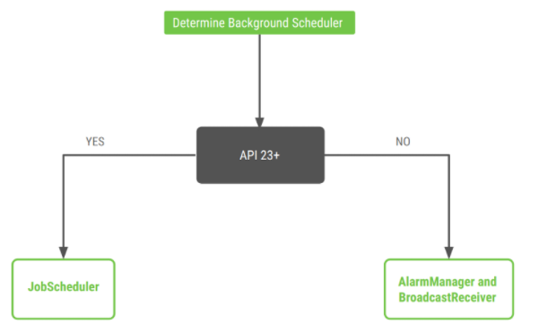

# WorkManager-Sample

하루 또는 1분 간격으로 로그찍어보는 워커매니저 샘플

# WorkManager

WorkManager는 지연 가능한 비동기 작업을 쉽게 예약할 수 있는 API이며, 보장된 실행을 제공합니다.

사용 예로는 서버에 로그를 전송하거나, 데이터베이스동기화 작업 등으로 이용하고, 정확한 시간에 작동을해야한다면 AlarmManager를 이용해야합니다.

# 기능

### 작업 제약조건
- 충전상태, 배터리상태, 저장공간상태, 네트워크연결상태, 유휴상태에따라 작업여부 설정가능

### 강력한 예약 관리
- 주기적 실행, 일회성 실행

### 유연한 재시도 정책
- doWork 메소드에서 failure, retry, success를 제공

### 작업체이닝
- A워커가 끝난후에 B워커 실행가능.

### 내장 스레딩 상호 운용성
- RxJAVA, Coroutine이용가능

# 참고

[WorkManger 설명](https://ryan94.tistory.com/33)  
[WorkManger 샘플](https://ryan94.tistory.com/34)
